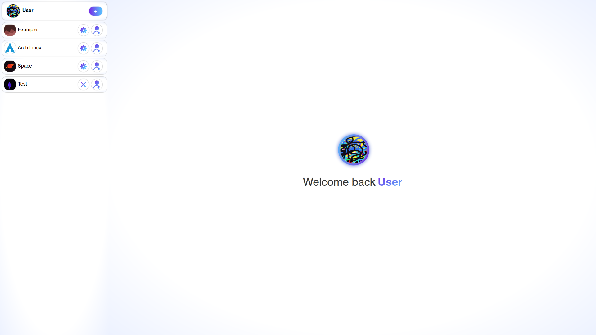
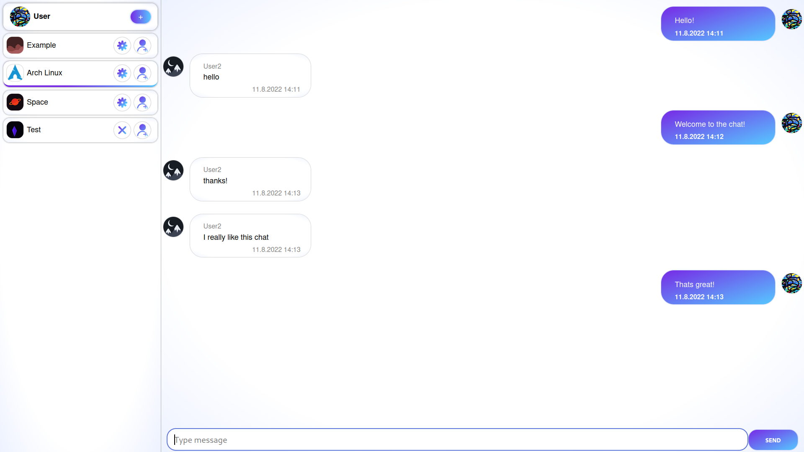
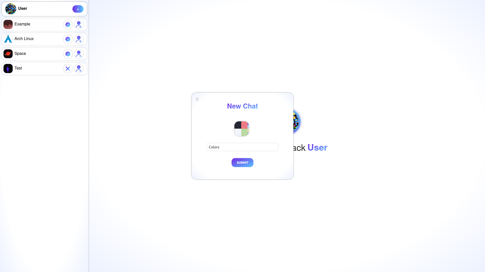
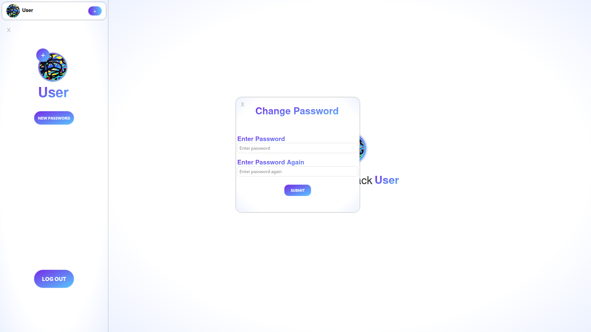
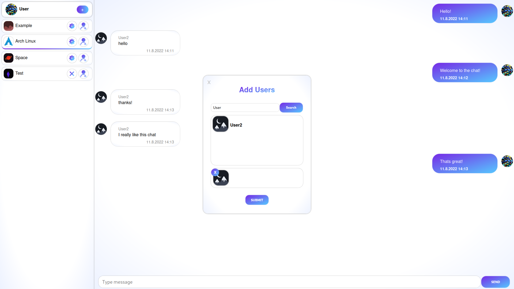
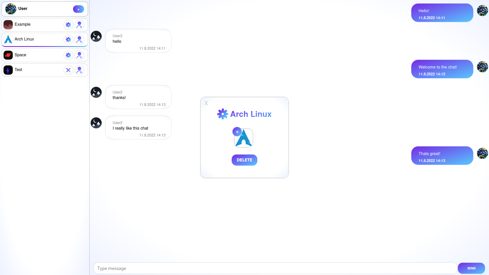

<div align="center">
	
</div>
<h1 align="center">Chatter</h1>
<p align="center">Chat web app for group chats</p>

- __Chatter__ is a chat application for the web written in typescript with __express and svelte__.
- The backend is made using [express](https://github.com/expressjs/express) and [nodejs](https://github.com/nodejs/node) as the runtime.
- The frontend is made using [svelte](https://github.com/sveltejs/svelte).

### Backend
- The backend is using sqlite as the database with the [prisma](https://github.com/prisma/prisma) orm for queries.
- The database uses 3 models:
	- User 
	- Chat
	- Message
- All database queries are used as methods from the __DB__ class.
- The api is running on port 3000 and is designed with the database models in mind.

| Route       | GET                                           | POST                                                             | PUT                  | DELETE                                      |
| --          | --                                            | --                                                               | --                   | --                                          |
| /login      | /                                             | Compares passwords and returns a token used by authenticateToken | /                    | /                                           |
| /user       | /                                             | Add user                                                         | Change user password | Disconects the user model from a chat model |
| /user/:name | Returns a list of users with a similar name   | /                                                                | /                    | /                                           |
| /user/image | /                                             | Add user image                                                   | /                    | Delete user image                           |
| /chat       | Returns a list of chats a user is a member of | Add chat                                                         | Add users to chat    | Delete chat                                 |
| /chat/image | /                                             | Add chat image                                                   | /                    | Delete chat image                           |
| /message    | /                                             | Add message                                                      | /                    | Delete message                              |
| /images     | displays image from given path                | /                                                                | /                    | /                                           |
- The clients are in sync with the messages and use [socket io](https://github.com/socketio/socket.io) __WebSockets__ to communicate.
- The server uses __json web tokens__ for authorization
- All user passwords are __hashed and salted__ by [bcrypt](https://github.com/kelektiv/node.bcrypt.js) before they are stored
- All images are stored in the static directory and [multer](https://github.com/expressjs/multer) is used as the midleware for downloading images.

### Frontend
- The frontend web app is written using __svelte__.
- [Socker.io client](https://github.com/socketio/socket.io-client) is used to send message and receave data between the client and the server.

| Message      | Use                                                                 |
| ---          | ---                                                                 |
| join         | Used for joining a client to a chat                                 |
| get-messages | Used for updating messages to every client that is in the same chat |

- The app is built by [vite](https://github.com/vitejs/vite) before being used by __nginx__.
- [Nginx](https://github.com/nginx/nginx) is used for running the app in a production enviroment.

### Run 
- For this you will need [docker](https://github.com/docker) and [docker-compose](https://github.com/docker/compose)
``` zsh
# Download the repo
git clone https://github.com/Vjg9/chatter
```

``` zsh
# Build the server docker container
# Before building change the secret from the Dockerfile
cd server && docker build -t chatter-server --target deploy .
```

``` zsh
# Build the app docker container 
cd app && docker build -t chatter-app --target deploy .
```

``` zsh
# Run the containers
# Before running change the database volume to desired location
docker-compose up
```

### Preview

- <p style="font-size:18px">Login page</p>
<div align="center">
	
</div>

- <p style="font-size:18px">Add user page</p>
<div align="center">
	
</div>

- <p style="font-size:18px">Welcome page</p>
<div align="center">
	
</div>

- <p style="font-size:18px" >Main chat window</p>
<div align="center">
	
</div>

- <p style="font-size:18px">Add chat popup</p>
<div align="center">
	
</div>

- <p style="font-size:18px">User settings</p>
<div align="center">
	
</div>

- <p style="font-size:18px">Add users to chat</p>
<div align="center">
	
</div>

- <p style="font-size:18px">Admin chat settings</p>
<div align="center">
	
</div>
